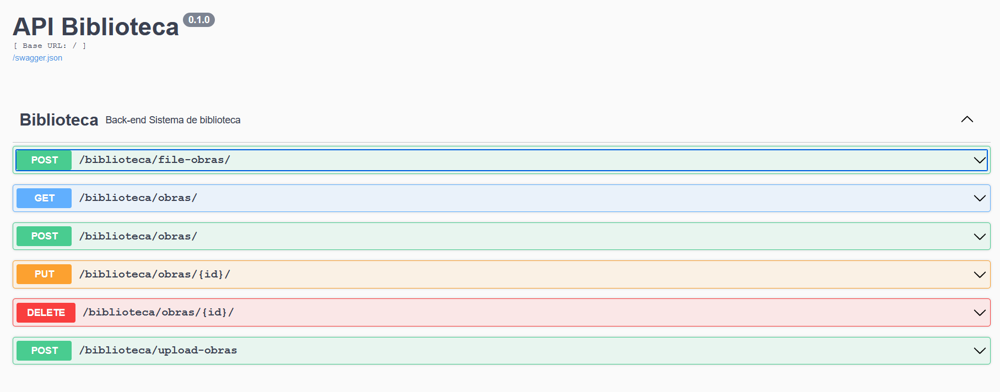

# DESAFIO PYTHON BACK-END

## Principais Bibliotecas


- [Python](https://www.python.org/) - Linguagem de Programação
- [Flask](https://flask.palletsprojects.com) - Biblioteca básica de roteamento 
- [Flask-Restx](https://flask-restx.readthedocs.io/en/latest/index.html) - Biblioteca que auxilia na  construção de API Rest
- [SQLAlchemy](https://www.sqlalchemy.org/) - ORM
- [Flask-Marshmallow](https://marshmallow-sqlalchemy.readthedocs.io/en/latest/index.html#) - Biblioteca de serialization/deserialization  de Objeto
- [Docker](https://docs.docker.com/reference/) - Container para aplicação
- [Docker-Compose](https://docs.docker.com/compose/) - Levantamento dos Containers
- [Pipenv](https://pypi.org/project/pipenv/) - Gerenciador de dependências
- [Postgresql](https://www.postgresql.org/) - Banco de dados
- [Celery](https://docs.celeryproject.org/en/stable/) - Fila de tarefas e tabalhos em background
- [RabbitMQ](https://www.rabbitmq.com/tutorials/tutorial-two-python.html) -  Broker de mensageria
- [Flake8](https://flake8.pycqa.org/en/latest/) - Guia de estilo[Pep8](https://www.python.org/dev/peps/pep-0008/)
- [Black](https://black.readthedocs.io/en/stable/) - O formatador de código descompromissado[Pep8]
- [Pre-commit](https://pre-commit.com/) -  É um gerenciador de pacotes multi-idioma para pre-commit hooks
- [SMTPLIB](https://docs.python.org/3/library/smtplib.html) - O módulo smtplib define um objeto de sessão de cliente SMTP que pode ser usado para enviar e-mail


## Requerimentos 
O projeto necessita de docker e docker-compose

## Rodando o Projeto
Clone esse projeto em sua máquina:
```bash
$ git clone https://github.com/Mario-Guilherme/desafio-backend-python.git
```
#### Certifique-se que a porta 5000(Flask), 15672(Rabbitmq), 5672(Rabbitmq), 5432(Postgresql), 8080(adminer)
Certificado que as portas acima estão livre,

Entre na pasta do projeto usando o comando:
```bash
$ cd desafio-backend-python
```
digite o comando em seu terminal para subir os containers do terminal.
```bash
$ docker-compose up --build
```
No seu Browser acesse : [http://localhost:5000/](http://localhost:5000)

## Rotas da API



Método POST [http://localhost:5000/file-obras/](http://localhost:5000/file-obras/) 
```json
{"email":"seu email"}
```
Método GET (http://localhost:5000/obras/)[http://localhost:5000/obras/]
retorna todas as obras

Método POST [http://localhost:5000/obras/](http://localhost:5000/obras/) 

```json
  {  
  "titulo": "Harry Potter", 
  "editora": "Rocco",
  "foto": "https://i.imgur.com/UH3IPXw.jpg",
   "autores": ["JK Rowling"]
   }

```

Método PUT [http://localhost:5000/obras/{id}/](http://localhost:5000/obras/{id}/) 
id substituto por um id do banco de dados
necessário ter as mesmas chaves, se faltar dará o erro um comum, 400, bad request
```json
  {  
  "titulo": "Outro livro", 
  "editora": "Rocco",
  "foto": "https://i.imgur.com/UH3IPXw.jpg",
   "autores": ["JK Rowling"]
   }

```

Método DELETE [http://localhost:5000/obras/{id}/](http://localhost:5000/obras/{id}/) 
Deleta a partir do id da requisição.

Método POST [http://localhost:5000/upload-obras](http://localhost:5000/upload-obras) 
deverá ser enviado um arquivo .csv para a rota com o formato:


Caso não funcione enviar a partir da rota Pela documentação da API funcionará


